# Spectrum of the preconditioned Hessian misfit operator
## The linear source inversion problem

We consider the following linear source inversion problem.
Find the state $$u \in H^1_{\Gamma_D}(\Omega)$$ and the source (*parameter*) $$m \in H^1(\Omega)$$ that solves

$$
\begin{aligned}
{} & \min_m \frac{1}{2} \| Bu - u_d \|^2 + \frac{1}{2} \int_\Omega \left[ \delta|m-m_0|^2 + \gamma|\nabla (m - m_0)|^2 \right] dx & {}\\
{\rm s.t.} & {} &{} \\
{} & -{\rm div}(k \nabla u) + {\bf v}\cdot \nabla u + cu = m & {\rm in} \; \Omega\\
{} & u = 0 & {\rm on } \; \Gamma_D\\
{} & k \frac{\partial u}{\partial n} = 0 & {\rm on } \; \Gamma_N\\
\end{aligned}
$$

Here:

- $$u_d$$ is a $$n_{\rm obs}$$ finite dimensional vector that denotes noisy observations of the state $$u$$ in $$n_{\rm obs}$$ locations $$\mathbf{x}_i$$, $$i=1,\ldots,n_{\rm obs}$$. Specifically, $$u_d(i) = u_{\rm true}( {\bf x}_i ) + \eta_i$$, where $$\eta_i$$ are i.i.d. $$\mathcal{N}(0, \sigma^2)$$.

- $$B: H^1_0(\Omega) \rightarrow {R}^{n_{\rm obs}}$$ is the linear operator that evaluates the state $$u$$ at the observation locations $$\mathbf{x}_i$$, $$i=1,\ldots,n_{\rm obs}$$.

- $$\delta$$ and $$\gamma$$ are the parameters of the regularization penalizing the $$L^2(\Omega)$$ and $$H^1(\Omega)$$ norm of $$m-m_0$$, respectively.

- $$k$$, $${\bf v}$$, $$c$$ are given coefficients representing the diffusivity coefficient, the advective velocity and the reaction term, respectively.

- $$\Gamma_D \subset \partial \Omega$$, $$\Gamma_N \subset \partial \Omega$$ represents the subdomain of $$\partial\Omega$$ where we impose Dirichlet or Neumann boundary conditions, respectively.


## 1. Load modules


```python
import matplotlib.pyplot as plt
%matplotlib inline

import dolfin as dl
import numpy as np

from hippylib import *


import logging
logging.getLogger('FFC').setLevel(logging.WARNING)
logging.getLogger('UFL').setLevel(logging.WARNING)
dl.set_log_active(False)
```

## 2. The linear source inversion problem


```python
def A_varf(u,p):
    return k*dl.inner(dl.nabla_grad(u), dl.nabla_grad(p))*dl.dx \
           + dl.inner(dl.nabla_grad(u), v*p)*dl.dx \
           + c*u*p*dl.dx
        
def f_varf(p):
    return dl.Constant(0.)*p*dl.dx
        
def C_varf(m,p):
           return -m*p*dl.dx
    
def R_varf(m_trial, m_test, gamma, delta):
    return dl.Constant(delta)*m_trial*m_test*dl.dx \
           + dl.Constant(gamma)*dl.inner(dl.grad(m_trial), dl.grad(m_test))*dl.dx

def u_boundary(x, on_boundary):
    return on_boundary and x[1] < dl.DOLFIN_EPS

class Hessian:
    def __init__(self, A_solver, At_solver, C,B,R):
        self.misfit_only = False
        self.A_solver = A_solver
        self.At_solver = At_solver
        self.C = C
        self.B = B
        self.R = R
        
        self.uhat = dl.Vector()
        self.C.init_vector(self.uhat,0)
        self.fwd_rhs = dl.Vector()
        self.C.init_vector(self.fwd_rhs,0)
        self.adj_rhs = dl.Vector()
        self.C.init_vector(self.adj_rhs,0)
        self.phat = dl.Vector()
        self.C.init_vector(self.phat,0)
        
    def init_vector(self, x, dim):
        self.R.init_vector(x,dim)
        
    def mult(self, x, y):
        y.zero()
        self.C.mult(x, self.fwd_rhs)
        self.A_solver.solve(self.uhat, self.fwd_rhs)
        self.B.transpmult(self.B*self.uhat, self.adj_rhs)
        self.At_solver.solve(self.phat, self.adj_rhs)
        self.C.transpmult(self.phat, y)
        
        if not self.misfit_only:
            y.axpy(1., self.R*x)
        

def solve(nx, ny, targets, gamma, delta, verbose=True):
    
    rand_gen = Random()
    mesh = dl.UnitSquareMesh(nx, ny)
    Vh1 = dl.FunctionSpace(mesh, 'Lagrange', 1)
    
    Vh = [Vh1, Vh1, Vh1]
    if verbose:
        print("Number of dofs: STATE={0}, PARAMETER={1}, ADJOINT={2}".format(
            Vh[STATE].dim(), Vh[PARAMETER].dim(), Vh[ADJOINT].dim()) )


    u_bdr = dl.Constant(0.0)
    bc = dl.DirichletBC(Vh[STATE], u_bdr, u_boundary)
    
    u_trial = dl.TrialFunction(Vh[STATE])
    u_test  = dl.TestFunction(Vh[STATE])
    m_trial = dl.TrialFunction(Vh[PARAMETER])
    m_test  = dl.TestFunction(Vh[PARAMETER])
    
    A,f = dl.assemble_system(A_varf(u_trial, u_test), f_varf(u_test), bcs=bc )
    A_solver = dl.PETScLUSolver()
    A_solver.set_operator(A)
    
    At,dummy = dl.assemble_system(dl.adjoint( A_varf(u_trial, u_test) ), dl.Constant(0.)*u_test*dl.dx, bcs=bc )
    At_solver = dl.PETScLUSolver()
    At_solver.set_operator(At)
    
    C = dl.assemble(C_varf(m_trial, u_test))
    bc.zero(C)
    
    R = dl.assemble(R_varf(m_trial, m_test, gamma, delta))
    R_solver = dl.PETScLUSolver()
    R_solver.set_operator(R)

    mtrue = dl.interpolate(
        dl.Expression('min(0.5,exp(-100*(pow(x[0]-0.35,2) +  pow(x[1]-0.7,2))))',degree=5), Vh[PARAMETER]).vector()
    m0 = dl.interpolate(dl.Constant(0.0), Vh[PARAMETER]).vector()
     
    if verbose:
        print( "Number of observation points: {0}".format(targets.shape[0]) )
    
    B = assemblePointwiseObservation(Vh[STATE], targets)
               
    #Generate synthetic observations
    utrue = dl.Function(Vh[STATE]).vector()
    A_solver.solve(utrue, -(C*mtrue) )
    d = B*utrue
    MAX = d.norm("linf")
    rel_noise = 0.01
    noise_std_dev = rel_noise * MAX
    rand_gen.normal_perturb(noise_std_dev, d)

    u = dl.Function(Vh[STATE]).vector()
    m = m0.copy()
    p = dl.Function(Vh[ADJOINT]).vector()
    mg = dl.Function(Vh[PARAMETER]).vector()
    rhs_adj = dl.Function(Vh[STATE]).vector()
    
    # Solve forward:
    A_solver.solve(u, -(C*m) )
    # rhs for adjoint
    B.transpmult(d-(B*u), rhs_adj)
    # solve adj problem
    At_solver.solve(p, rhs_adj)
    #gradient
    C.transpmult(p, mg)
    mg.axpy(1., R*m)
   

    H = Hessian(A_solver,At_solver,C,B,R)

    solver = CGSolverSteihaug()
    solver.set_operator(H)
    solver.set_preconditioner( R_solver )
    solver.parameters["print_level"] = -1
    solver.parameters["rel_tolerance"] = 1e-9
    solver.solve(m, -mg)

    if solver.converged:
        if verbose:
            print ("CG converged in ", solver.iter, " iterations.")
    else:
        print( "CG did not converged.")
        raise

    # Solve forward:
    A_solver.solve(u, -(C*m) )
 
    if verbose:
        plt.figure(figsize=(18,8))
        plt.subplot(2, 3, 1)
        dl.plot(dl.Function(Vh[PARAMETER], mtrue), title = "True source")
        plt.subplot(2, 3, 2)
        dl.plot(dl.Function(Vh[STATE], utrue), title="True state")
        plt.subplot(2, 3, 3)
        nb.plot_pts(targets, d,mytitle="Observations")
        plt.subplot(2, 3, 4)
        dl.plot(dl.Function(Vh[PARAMETER], m), title = "Reconstructed source")
        plt.subplot(2, 3, 5)
        dl.plot(dl.Function(Vh[STATE], u), title="Reconstructed state")
        plt.subplot(2, 3, 6)
        nb.plot_pts(targets, B*u-d,mytitle="Misfit")
        plt.show()

    H.misfit_only = True
    k_evec = 80
    p_evec = 5
    if verbose:
        print ("Double Pass Algorithm. Requested eigenvectors: {0}; Oversampling {1}.".format(k_evec,p_evec))
    
    Omega = MultiVector(m, k_evec+p_evec)
    rand_gen.normal(1., Omega)
    lmbda, U = doublePassG(H, R, R_solver, Omega, k_evec)

    if verbose:
        plt.figure()
        nb.plot_eigenvalues(lmbda, mytitle="Generalized Eigenvalues")
        nb.plot_eigenvectors(Vh[PARAMETER], U, mytitle="Eigenvectors", which=[0,1,2,5,10,15])
        plt.show()
        
    return lmbda, U, Vh[PARAMETER], solver.iter

```

## 3. Solution of the source inversion problem


```python
ndim = 2
nx = 32
ny = 32

ntargets = 256
np.random.seed(seed=1)
targets = np.random.uniform(0.1,0.9, [ntargets, ndim] )


gamma = 1e-5
delta = 1e-9

k = dl.Constant(1.0)
v = dl.Constant((0.0, 0.0))
c = dl.Constant(0.1)

lmbda, U, Vm, nit = solve(nx,ny, targets, gamma, delta)
```

    Number of dofs: STATE=1089, PARAMETER=1089, ADJOINT=1089
    Number of observation points: 256
    CG converged in  38  iterations.


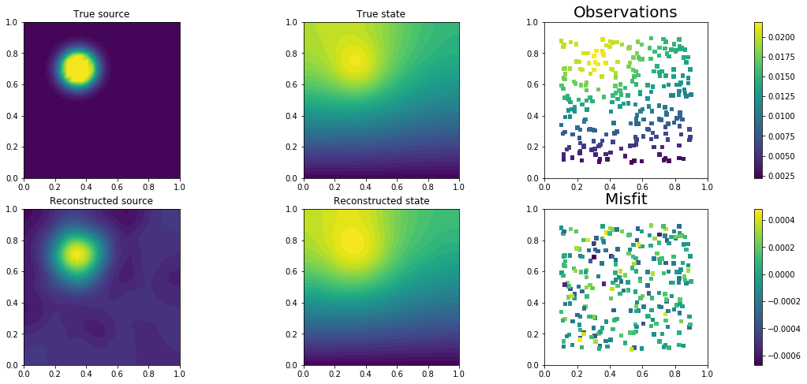


    Double Pass Algorithm. Requested eigenvectors: 80; Oversampling 5.


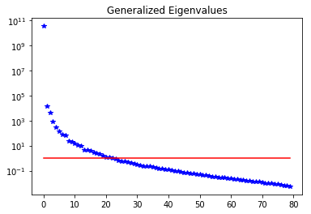


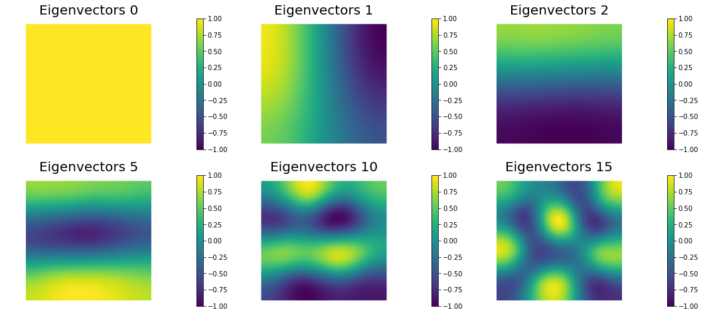


## 4. Mesh independence of the spectrum of the preconditioned Hessian misfit


```python
gamma = 1e-5
delta = 1e-9

k = dl.Constant(1.0)
v = dl.Constant((0.0, 0.0))
c = dl.Constant(0.1)

n = [16,32,64]
lmbda1, U1, Vm1, niter1 = solve(n[0],n[0], targets, gamma, delta,verbose=False)
lmbda2, U2, Vm2, niter2 = solve(n[1],n[1], targets, gamma, delta,verbose=False)
lmbda3, U3, Vm3, niter3 = solve(n[2],n[2], targets, gamma, delta,verbose=False)

print ("Number of Iterations: ", niter1, niter2, niter3)
plt.figure(figsize=(18,4))
nb.plot_eigenvalues(lmbda1, mytitle="Eigenvalues Mesh {0} by {1}".format(n[0],n[0]), subplot_loc=131)
plt.ylim([1e-3,1e11])
nb.plot_eigenvalues(lmbda2, mytitle="Eigenvalues Mesh {0} by {1}".format(n[1],n[1]), subplot_loc=132)
plt.ylim([1e-3,1e11])
nb.plot_eigenvalues(lmbda3, mytitle="Eigenvalues Mesh {0} by {1}".format(n[2],n[2]), subplot_loc=133)
plt.ylim([1e-3,1e11])

nb.plot_eigenvectors(Vm1, U1, mytitle="Mesh {0} by {1} Eigenvector".format(n[0],n[0]), which=[0,1,5])
nb.plot_eigenvectors(Vm2, U2, mytitle="Mesh {0} by {1} Eigenvector".format(n[1],n[1]), which=[0,1,5])
nb.plot_eigenvectors(Vm3, U3, mytitle="Mesh {0} by {1} Eigenvector".format(n[2],n[2]), which=[0,1,5])

plt.show()
```

    Number of Iterations:  37 38 36


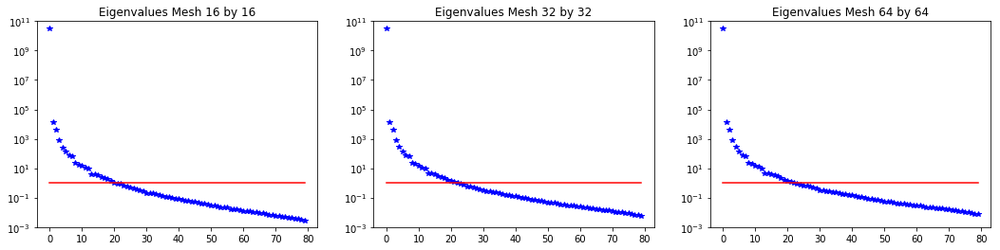


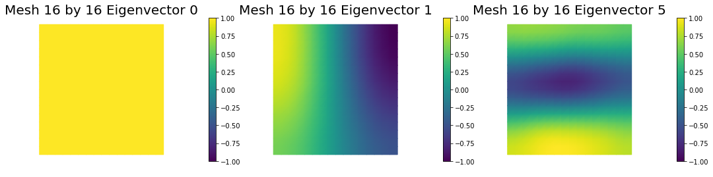


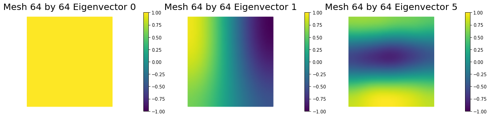


## 5. Dependence on regularization parameters

We solve the problem for different values of the regularization parameters. 


```python
gamma = [1e-4, 1e-5, 1e-6]
delta = [1e-8, 1e-9, 1e-10]

k = dl.Constant(1.0)
v = dl.Constant((0.0, 0.0))
c = dl.Constant(0.1)

lmbda1, U1, Vm1, niter1 = solve(nx,ny, targets, gamma[0], delta[0],verbose=False)
lmbda2, U2, Vm2, niter2 = solve(nx,ny, targets, gamma[1], delta[1],verbose=False)
lmbda3, U3, Vm3, niter3 = solve(nx,ny, targets, gamma[2], delta[2],verbose=False)

print ("Number of Iterations: ", niter1, niter2, niter3)
plt.figure(figsize=(18,4))
nb.plot_eigenvalues(lmbda1, mytitle="Eigenvalues gamma={0:1.1e}".format(gamma[0]), subplot_loc=131)
plt.ylim([1e-3,1e12])
nb.plot_eigenvalues(lmbda2, mytitle="Eigenvalues gamma={0:1.1e}".format(gamma[1]), subplot_loc=132)
plt.ylim([1e-3,1e12])
nb.plot_eigenvalues(lmbda3, mytitle="Eigenvalues gamma={0:1.1e}".format(gamma[2]), subplot_loc=133)
plt.ylim([1e-3,1e12])

nb.plot_eigenvectors(Vm1, U1, mytitle="gamma={0:1.1e} Eigenvector".format(gamma[0]), which=[0,1,5])
nb.plot_eigenvectors(Vm2, U2, mytitle="gamma={0:1.1e} Eigenvector".format(gamma[1]), which=[0,1,5])
nb.plot_eigenvectors(Vm3, U3, mytitle="gamma={0:1.1e} Eigenvector".format(gamma[2]), which=[0,1,5])

plt.show()
```

    Number of Iterations:  23 38 64


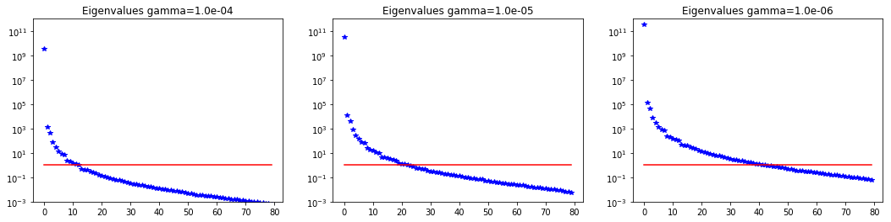


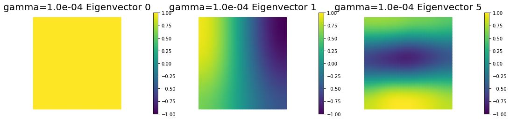


## 6. Dependence on the PDE coefficients

Assume a constant reaction term $$c = 0.1$$, and we consider different values for the diffusivity coefficient $$k$$.

The smaller the value of $$k$$ the slower the decay in the spectrum.


```python
gamma = 1e-5
delta = 1e-9

k = dl.Constant(1.0)
v = dl.Constant((0.0, 0.0))
c = dl.Constant(0.1)

lmbda1, U1, Vm1, niter1 = solve(nx,ny, targets, gamma, delta,verbose=False)
k = dl.Constant(0.1)
lmbda2, U2, Vm2, niter2 = solve(nx,ny, targets, gamma, delta,verbose=False)
k = dl.Constant(0.01)
lmbda3, U3, Vm3, niter3 = solve(nx,ny, targets, gamma, delta,verbose=False)

print ("Number of Iterations: ", niter1, niter2, niter3)
plt.figure(figsize=(18,4))
nb.plot_eigenvalues(lmbda1, mytitle="Eigenvalues k=1.0", subplot_loc=131)
plt.ylim([1e-2,1e14])
nb.plot_eigenvalues(lmbda2, mytitle="Eigenvalues k=0.1", subplot_loc=132)
plt.ylim([1e-2,1e14])
nb.plot_eigenvalues(lmbda3, mytitle="Eigenvalues k=0.01", subplot_loc=133)
plt.ylim([1e-2,1e14])

nb.plot_eigenvectors(Vm1, U1, mytitle="k=1. Eigenvector", which=[0,1,5])
nb.plot_eigenvectors(Vm2, U2, mytitle="k=0.1 Eigenvector", which=[0,1,5])
nb.plot_eigenvectors(Vm3, U3, mytitle="k=0.01 Eigenvector", which=[0,1,5])

plt.show()
```

    Number of Iterations:  38 123 731


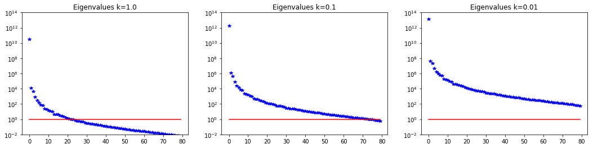


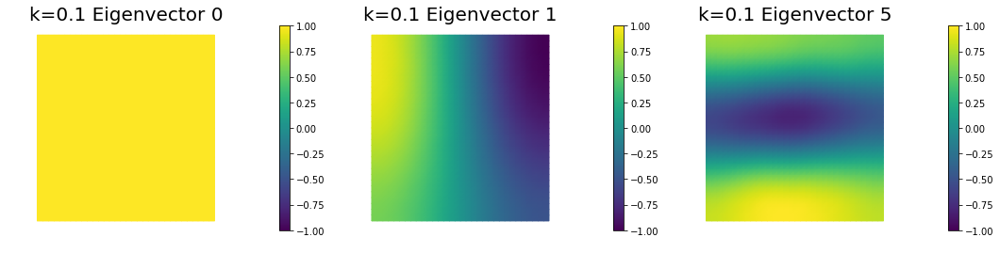


## 7. Dependence on the number of observations


```python
ntargets = [16, 64, 256]

gamma = 1e-5
delta = 1e-9

k = dl.Constant(0.1)
v = dl.Constant((0.0, 0.0))
c = dl.Constant(0.1)

lmbda1, U1, Vm1, niter1 = solve(nx,ny, targets[0:ntargets[0],:], gamma, delta,verbose=False)
lmbda2, U2, Vm2, niter2 = solve(nx,ny, targets[0:ntargets[1],:], gamma, delta,verbose=False)
lmbda3, U3, Vm3, niter3 = solve(nx,ny, targets[0:ntargets[2],:], gamma, delta,verbose=False)

print ("Number of Iterations: ", niter1, niter2, niter3)
plt.figure(figsize=(18,4))
nb.plot_eigenvalues(lmbda1, mytitle="Eigenvalues ntargets={0}".format(ntargets[0]), subplot_loc=131)
plt.ylim([1e-6,1e12])
nb.plot_eigenvalues(lmbda2, mytitle="Eigenvalues ntargets={0}".format(ntargets[1]), subplot_loc=132)
plt.ylim([1e-6,1e12])
nb.plot_eigenvalues(lmbda3, mytitle="Eigenvalues ntargets={0}".format(ntargets[2]), subplot_loc=133)
plt.ylim([1e-6,1e12])

nb.plot_eigenvectors(Vm1, U1, mytitle="ntargets={0} Eigenvector".format(ntargets[0]), which=[0,1,5])
nb.plot_eigenvectors(Vm2, U2, mytitle="ntargets={0} Eigenvector".format(ntargets[1]), which=[0,1,5])
nb.plot_eigenvectors(Vm3, U3, mytitle="ntargets={0} Eigenvector".format(ntargets[2]), which=[0,1,5])

plt.show()
```

    Number of Iterations:  31 91 123


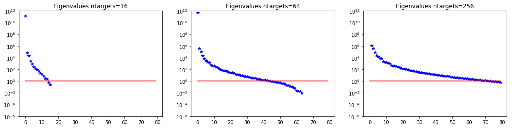


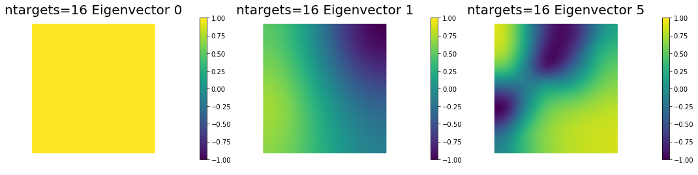


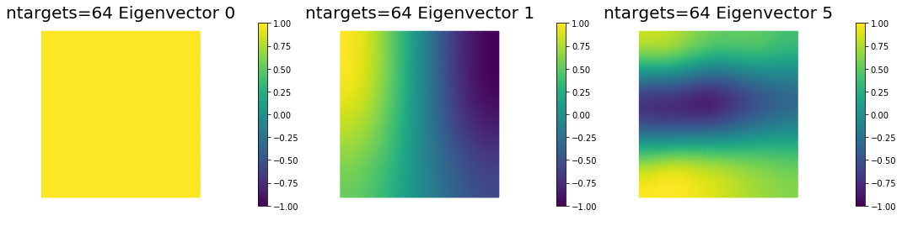


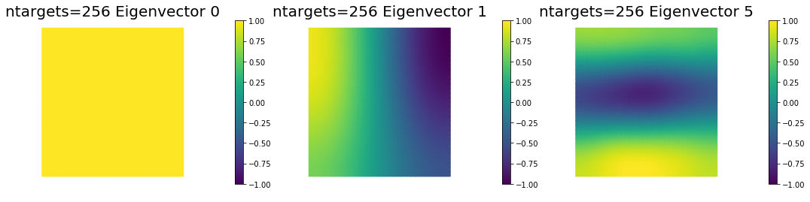


> Copyright &copy; 2016-2018, The University of Texas at Austin & University of California, Merced.
All Rights reserved.
See file COPYRIGHT for details.

> This file is part of the hIPPYlib library. For more information and source code
availability see https://hippylib.github.io.

> hIPPYlib is free software; you can redistribute it and/or modify it under the terms of the GNU General Public License (as published by the Free Software Foundation) version 2.0 dated June 1991.
