# Minimization of nonlinear energy functional

In this example we solve the following nonlinear minimization problem

*Find * $$u^* \in H^1_0(\Omega)$$ *such that*

$$ u^* = \operatorname*{argmin}_{u \in H^1_0(\Omega)} \Pi(u). $$

Here the energy functional $$\Pi(u)$$ has the form

$$ \Pi(u) = \frac{1}{2} \int_\Omega k(u) \nabla u \cdot \nabla u \, dx - \int_\Omega f\,u \, dx,$$

where

$$k(u) = k_1 + k_2 u^2. $$

## Necessary optimality condition (Euler-Lagrange condition)

Let $$\delta_u \Pi(u, \hat{u})$$ denote the first variation of $$\Pi(u)$$ in the *direction* $$\hat{u}$$, i.e.

$$\delta_u \Pi(u, \hat{u}) := \left. \frac{d}{d \varepsilon} \Pi(u + \varepsilon \hat{u})\right|_{\varepsilon=0} = \lim_{\varepsilon \rightarrow 0} \frac{\Pi(u + \varepsilon \hat{u}) - \Pi(u)}{\varepsilon}.$$

The necessary condition is that the first variation of $$\Pi(u)$$ equals to 0 for all directions $$\hat{u}$$:

$$ \delta_u \Pi = 0 \Longleftrightarrow \lim_{\varepsilon \rightarrow 0} \frac{\Pi(u + \varepsilon \hat{u}) - \Pi(u)}{\varepsilon} = 0 \quad \forall \hat{u} \in H_0^1(\Omega).$$

### Weak form:

To obtain the weak form of the above necessary condition, we first expand the term $$\Pi(u + \varepsilon \hat{u})$$ as

$$\Pi(u + \varepsilon \hat{u}) = \frac{1}{2} \int_\Omega [k_1 + k_2(u + \varepsilon\hat{u})^2] (\nabla u + \varepsilon \nabla \hat{u})\cdot(\nabla u + \varepsilon \nabla \hat{u}) dx - \int_\Omega f\,(u+\varepsilon\hat{u}) dx.$$

After some simplification, we obtain

$$\frac{\Pi(u + \varepsilon \hat{u}) - \Pi(u)}{\epsilon} = \int_\Omega \left[k_2 u \hat{u} \nabla u \cdot \nabla u + (k_1 + k_2u^2)\nabla \hat{u}\cdot \nabla u\right] dx - \int_\Omega f \hat{u} dx + \mathcal{O}(\epsilon).$$

By neglecting the $$\mathcal{O}(\epsilon)$$ terms, we write the weak form of the necessary conditions as

*Find *$$u\in H_0^1(\Omega)$$ *such that*

$$ \int_\Omega \left[k_2 u \hat{u} \nabla u \cdot \nabla u + (k_1 + k_2u^2)\nabla \hat{u}\cdot \nabla u\right] dx = \int_\Omega f \hat{u} dx \quad \forall \hat{u} \in H_0^1.$$

### Strong form:
To obtain the strong form, we invoke Green's first identity and write

$$ \int_\Omega \left[k_2 u \nabla u \cdot \nabla u -  \nabla \cdot [(k_1 + k_2u^2) \nabla u] \right] \hat{u} dx + \int_{\partial \Omega} [(k_1 + k_2u^2) \nabla u]\cdot n \hat{u} ds = \int_\Omega f \hat{u} dx \quad \forall \hat{u} \in H_0^1.$$

Since $$\hat{u}$$ is arbitrary in $$\Omega$$ and $$\hat{u} = 0$$ on $$\partial \Omega$$, the strong form of the non-linear boundary problem reads

$$ - \nabla \cdot [(k_1 + k_2u^2) \nabla u + k_2 u \nabla u \cdot \nabla u = f \quad {\rm in} \; \Omega; $$
$$ u = 0 \quad {\rm on} \; \partial\Omega.$$

## Infinite-dimensional Newton's Method

Consider the expansion of the first variation $$\delta_u \Pi(u, \hat{u})$$ about $$u$$ in a *direction* $$\tilde{u}$$

$$\delta_u \Pi(u+\tilde{u}, \hat{u}) \approx \delta_u \Pi(u, \hat{u}) + \delta_u^2\Pi(u, \hat{u}, \tilde{u}),$$

where

$$ \delta_u^2\Pi(u, \hat{u}, \tilde{u}) = \left. \frac{d}{d\varepsilon} \delta_u \Pi(u + \varepsilon \tilde{u}, \hat{u}) \right|_{\varepsilon=0}.$$

The infinite-dimensional Newton's method reads

*Given the current solution *$$u_k$$, *find* $$\tilde{u} \in H^1_0$$ *such that*

$$ \delta_u^2 \Pi(u_k, \hat{u}, \tilde{u}) = -\delta_u \Pi(u_k, \hat{u}) \quad \forall \, \hat{u} \in H_0^1.$$

*Update the solution using the Newton direction* $$\tilde{u}$$
$$ u_{k+1} = u_k + \tilde{u}.$$

### Hessian

To derive the weak form of the Hessian, we first expand the term $$\delta_u \Pi(u +\varepsilon \tilde{u},\hat{u})$$ as

$$\delta_u \Pi(u+\varepsilon\tilde{u}, \hat{u}) = \int_\Omega \left[k_2 (u+\varepsilon\tilde{u}) \hat{u} \nabla (u+\varepsilon\tilde{u}) \cdot \nabla (u+\varepsilon\tilde{u}) + (k_1 + k_2(u+\varepsilon\tilde{u})^2)\nabla \hat{u}\cdot \nabla (u+\varepsilon\tilde{u}) \right] dx - \int_\Omega f \hat{u} dx \quad \forall \hat{u} \in H_0^1.$$

Then, after some simplification, we obtain

$$\delta^2 \Pi(u, \tilde{u}, \hat{u}) := \frac{d}{d\varepsilon} \delta_u \Pi(u+\varepsilon\tilde{u}, \hat{u}) = 
\int_\Omega \left[k_2\tilde{u}\hat{u}\nabla u \cdot \nabla u + 2k_2 u \hat{u} \nabla \tilde{u} \cdot \nabla u + 2k_2 u \tilde{u} \nabla \hat{u} \cdot \nabla u + (k_1 + k_2u^2) \nabla \hat{u} \cdot \nabla \tilde{u} \right] dx. $$

### Weak form of Newton step:

*Given *$$u \in H_0^1$$, *find * $$\tilde{u} \in H^1_0$$ *such that*

$$\int_\Omega \left[k_2\tilde{u}\hat{u}\nabla u \cdot \nabla u + 2k_2 u \hat{u} \nabla \tilde{u} \cdot \nabla u + 2k_2 u \tilde{u} \nabla \hat{u} \cdot \nabla u + (k_1 + k_2u^2) \nabla \hat{u} \cdot \nabla \tilde{u} \right] dx = - \int_\Omega \left[k_2 u \hat{u} \nabla u \cdot \nabla u + (k_1 + k_2u^2)\nabla \hat{u}\cdot \nabla u -f \hat{u} \right] dx \quad \forall \, \hat{u} \in H_0^1. $$

The solution is then updated using the Newton direction $$\tilde{u}$$

$$ u^{\rm new} = u + \alpha \tilde{u}.$$

Here $$\alpha$$ denotes a relaxation parameter (back-tracking/line-search) used to achieve global convergence of the Newton method.

### Strong form of the Newton step

$$ - \nabla \cdot \left[ (k_1 + k_2 u^2) \nabla \tilde{u}\right] + 2k_2u\nabla\tilde{u}\cdot\nabla u - \nabla\cdot(2k_2 u \tilde{u} \nabla u) + k_2 \tilde{u} \nabla u \nabla u = \nabla \cdot\left[(k_1 + k_2 u^2)\nabla \right]u - k_2 u \nabla u\cdot \nabla u + f \quad {\rm in} \, \Omega.$$
$$ \tilde{u} = 0 \quad {\rm on} \, \partial \Omega. $$

## 1. Load modules

To start we load the following modules:

- dolfin: the python/C++ interface to FEniCS

- [math](https://docs.python.org/2/library/math.html): the python module for mathematical functions

- [numpy](http://www.numpy.org/): a python package for linear algebra

- [matplotlib](http://matplotlib.org/): a python package used for plotting the results


```python
from __future__ import print_function, division, absolute_import

import dolfin as dl

import matplotlib.pyplot as plt
%matplotlib inline

from hippylib import nb

import math
import numpy as np
import logging

logging.getLogger('FFC').setLevel(logging.WARNING)
logging.getLogger('UFL').setLevel(logging.WARNING)
dl.set_log_active(False)
```

## 2. Define the mesh and finite element spaces

We construct a triangulation (mesh) $$\mathcal{T}_h$$ of the computational domain $$\Omega := [0, 1]^2$$ with `nx` elements in the *x*-axis direction and `ny` elements in the *y*-axis direction.

On the mesh $$\mathcal{T}_h$$, we then define the finite element space $$V_h \subset H^1(\Omega)$$ consisting of globally continuous piecewise linear functions and we create a function $$u \in V_h$$.

By denoting by $$\left[{\phi_i(x)}\right]_{i=1}^{ {\rm dim}(V_h)}$$ the finite element basis for the space $$V_h$$ we have
$$ u = \sum_{i=1}^{ {\rm dim}(V_h)} {\rm u}_i \phi_i(x), $$
where $${\rm u}_i$$ represents the coefficients in the finite element expansion of $$u$$.

Finally we define two special types of functions: the `TestFunction` $$\hat{u}$$ and the `TrialFunction` $$\tilde{u}$$. These special types of functions are used by `FEniCS` to generate the finite element vectors and matrices which stem from the first and second variations of the energy functional $$\Pi$$.


```python
nx = 32
ny = 32
mesh = dl.UnitSquareMesh(nx,ny)
Vh = dl.FunctionSpace(mesh, "CG", 1)

uh = dl.Function(Vh)
u_hat = dl.TestFunction(Vh)
u_tilde = dl.TrialFunction(Vh)

nb.plot(mesh, show_axis="on")
print( "dim(Vh) = ", Vh.dim() )
```

    dim(Vh) =  1089


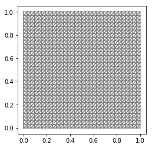


## 3. Define the energy functional

We now define the energy functional
$$ \Pi(u) = \frac{1}{2} \int_\Omega (k_1 + k_2u^2) \nabla u \cdot \nabla u dx - \int_\Omega f\,u dx.$$

The parameters $$k_1$$, $$k_2$$ and the forcing term $$f$$ are defined in FEniCS using the keyword [`Constant`](https://fenicsproject.org/olddocs/dolfin/2017.2.0/python/programmers-reference/functions/constant/Constant.html). To define coefficients that are space dependent one should use the keyword [`Expression`](https://fenicsproject.org/olddocs/dolfin/2017.2.0/python/programmers-reference/functions/expression/Expression.html).

The Dirichlet boundary condition
$$ u = 0 \quad {\rm on} \; \partial\Omega$$
is imposed using the [`DirichletBC`](https://fenicsproject.org/olddocs/dolfin/2017.2.0/python/programmers-reference/fem/bcs/DirichletBC.html) class.

To construct this object we need to provide

- the finite element space `Vh`

- the value `u_0` of the solution at the Dirichlet boundary. `u_0` can either be a `Constant` or an `Expression` object.

- the object `Boundary` that defines on which part of $$\partial \Omega$$ we want to impose such condition.


```python
f = dl.Constant(1.)
k1 = dl.Constant(0.05)
k2 = dl.Constant(1.)

Pi = dl.Constant(.5)*(k1 + k2*uh*uh)*dl.inner(dl.grad(uh), dl.grad(uh))*dl.dx - f*uh*dl.dx

class Boundary(dl.SubDomain):
    def inside(self, x, on_boundary):
        return on_boundary

u_0 = dl.Constant(0.)    
bc = dl.DirichletBC(Vh,u_0, Boundary() )
```

## 4. First variation

The weak form of the first variation reads

$$\delta_u \Pi(u, \hat{u}) = \int_\Omega \left[k_2 u \hat{u} \nabla u \cdot \nabla u + (k_1 + k_2u^2)\nabla \hat{u}\cdot \nabla u\right] dx - \int_\Omega f \hat{u} dx \quad \forall \hat{u} \in H_0^1.$$

We use a **finite difference check** to verify that our derivation is correct.
More specifically, we consider a function
$$ u_0 = x(x-1)y(y-1) \in H^1_0(\Omega) $$
and we verify that for a random direction $$\hat{u} \in H^1_0(\Omega)$$ we have
$$ r := \left| \frac{\Pi(u_0 + \varepsilon \hat{u}) - \Pi(u_0)}{\varepsilon} - \delta_u \Pi(u, \hat{u})\right| = \mathcal{O}(\varepsilon).$$

In the figure below we show in a loglog scale the value of $$r$$ as a function of $$\varepsilon$$. We observe that $$r$$ decays linearly for a wide range of values of $$\varepsilon$$, however we notice an increase in the error for extremely small values of $$\varepsilon$$ due to numerical stability and finite precision arithmetic.

**NOTE:** To compute the first variation we can also use the [automatic differentiation](https://fenicsproject.org/olddocs/dolfin/2017.2.0/python/programmers-reference/fem/formmanipulations/derivative.html#dolfin.fem.formmanipulations.derivative) of variational forms capabilities of FEniCS and write

`grad = dl.derivative(Pi, u, u_hat)`


```python
grad = (k2*uh*u_hat)*dl.inner(dl.grad(uh), dl.grad(uh))*dl.dx + \
       (k1 + k2*uh*uh)*dl.inner(dl.grad(uh), dl.grad(u_hat))*dl.dx - f*u_hat*dl.dx

u0 = dl.interpolate(dl.Expression("x[0]*(x[0]-1)*x[1]*(x[1]-1)", degree=2), Vh)

n_eps = 32
eps = 1e-2*np.power(2., -np.arange(n_eps))
err_grad = np.zeros(n_eps)

uh.assign(u0)
pi0 = dl.assemble(Pi)
grad0 = dl.assemble(grad)

uhat = dl.Function(Vh).vector()
uhat.set_local(np.random.randn(Vh.dim()))
uhat.apply("")
bc.apply(uhat)
dir_grad0 = grad0.inner(uhat)

for i in range(n_eps):
    uh.assign(u0)
    uh.vector().axpy(eps[i], uhat) #uh = uh + eps[i]*dir
    piplus = dl.assemble(Pi)
    err_grad[i] = abs( (piplus - pi0)/eps[i] - dir_grad0 )

plt.figure()    
plt.loglog(eps, err_grad, "-ob", label="Error Grad")
plt.loglog(eps, (.5*err_grad[0]/eps[0])*eps, "-.k", label="First Order")
plt.title("Finite difference check of the first variation (gradient)")
plt.xlabel("eps")
plt.ylabel("Error grad")
plt.legend(loc = "upper left")
plt.show()
```


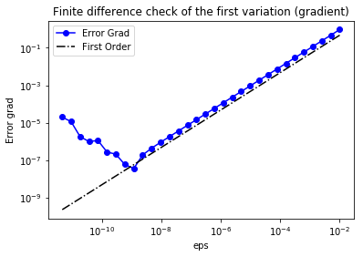


## 5. Second variation

The weak form of the second variation reads

$$\delta_u^2 \Pi(u, \tilde{u}, \hat{u}) := \frac{d}{d\varepsilon} \delta_u \Pi(u+\varepsilon\tilde{u}, \hat{u}) = 
\int_\Omega \left[k_2\tilde{u}\hat{u}\nabla u \cdot \nabla u + 2k_2 u \hat{u} \nabla \tilde{u} \cdot \nabla u + 2k_2 u \tilde{u} \nabla \hat{u} \cdot \nabla u + (k_1 + k_2u^2) \nabla \hat{u} \cdot \nabla \tilde{u} \right] dx. $$

As before, we verify that for a random direction $$\hat{u} \in H^1_0(\Omega)$$ we have
$$ r := \left\| \frac{\delta_u\Pi(u_0 + \varepsilon \tilde{u}, \hat{u}) - \delta_u \Pi(u_0, \hat{u})}{\varepsilon} - \delta_u^2 \Pi(u, \tilde{u}, \hat{u})\right\| = \mathcal{O}(\varepsilon).$$

In the figure below we show in a loglog scale the value of $$r$$ as a function of $$\varepsilon$$. As before, we observe that $$r$$ decays linearly for a wide range of values of $$\varepsilon$$, however we notice an increase in the error for extremely small values of $$\varepsilon$$ due to numerical stability and finite precision arithmetic.

**NOTE:** To compute the second variation we can also use automatic differentiation and write

`H = dl.derivative(grad, u, u_tilde)`


```python
H = k2*u_tilde*u_hat*dl.inner(dl.grad(uh), dl.grad(uh))*dl.dx + \
     dl.Constant(2.)*(k2*uh*u_hat)*dl.inner(dl.grad(u_tilde), dl.grad(uh))*dl.dx + \
     dl.Constant(2.)*k2*u_tilde*uh*dl.inner(dl.grad(uh), dl.grad(u_hat))*dl.dx + \
     (k1 + k2*uh*uh)*dl.inner(dl.grad(u_tilde), dl.grad(u_hat))*dl.dx

uh.assign(u0)
H_0 = dl.assemble(H)
H_0uhat = H_0 * uhat
err_H = np.zeros(n_eps)

for i in range(n_eps):
    uh.assign(u0)
    uh.vector().axpy(eps[i], uhat)
    grad_plus = dl.assemble(grad)
    diff_grad = (grad_plus - grad0)
    diff_grad *= 1/eps[i]
    err_H[i] = (diff_grad - H_0uhat).norm("l2")
    
plt.figure()    
plt.loglog(eps, err_H, "-ob", label="Error Hessian")
plt.loglog(eps, (.5*err_H[0]/eps[0])*eps, "-.k", label="First Order")
plt.title("Finite difference check of the second variation (Hessian)")
plt.xlabel("eps")
plt.ylabel("Error Hessian")
plt.legend(loc = "upper left")
plt.show()
```


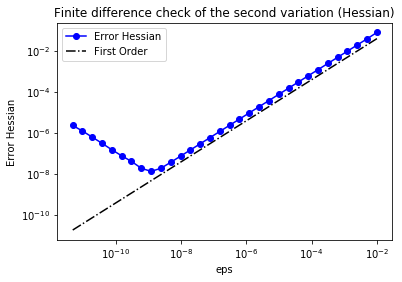


## 6. The infinite dimensional Newton Method

The infinite dimensional Newton step reads

*Given *$$u_n \in H_0^1$$, *find * $$\tilde{u} \in H^1_0$$ *such that*
$$ \delta_u^2 \Pi(u_n, \hat{u}, \tilde{u}) =  - \delta_u \Pi(u_n, \hat{u}) \quad $$
Update the solution $$u_{n+1}$$ using the Newton direction $$\tilde{u}$$
$$ u_{n+1} = u + \alpha \tilde{u}.$$

Here, for simplicity, we choose $$\alpha$$ equal to 1. In general, to guarantee global convergence of the Newton method the parameter $$\alpha$$ should be appropriately chosen (e.g. *back-tracking* or *line search*).

The linear systems to compute the Newton directions are solved using the conjugate gradient (CG) with algebraic multigrid preconditioner with a fixed tolerance. In practice, one should solve the Newton system inexactly by early termination of CG 
iterations via Eisenstat–Walker (to prevent oversolving) and Steihaug (to avoid negative curvature) criteria.

In the output below, for each iteration we report the number of CG iterations, the value of the energy functional, the norm of the gradient, and the inner product between the gradient and the Newton direction $$\delta_u \Pi(u_0, \tilde{u})$$.

In the example, the stopping criterion is relative norm of the gradient $$\frac{\delta_u \Pi(u_n, \hat{u})}{\delta_u \Pi(u_0, \hat{u})} \leq \tau$$. However robust implementation of the stopping criterion should monitor also the quantity $$\delta_u \Pi(u_0, \tilde{u})$$.


```python
uh.assign(dl.interpolate(dl.Constant(0.), Vh))

rtol = 1e-9
max_iter = 10

pi0 = dl.assemble(Pi)
g0 = dl.assemble(grad)
bc.apply(g0)
tol = g0.norm("l2")*rtol

du = dl.Function(Vh).vector()

lin_it = 0
print ("{0:3} {1:3} {2:15} {3:15} {4:15}".format(
      "It", "cg_it", "Energy", "(g,du)", "||g||l2") )

for i in range(max_iter):
    [Hn, gn] = dl.assemble_system(H, grad, bc)
    if gn.norm("l2") < tol:
        print ("\nConverged in ", i, "Newton iterations and ", lin_it, "linear iterations.")
        break
    myit = dl.solve(Hn, du, gn, "cg", "petsc_amg")
    lin_it = lin_it + myit
    uh.vector().axpy(-1., du)
    pi = dl.assemble(Pi)
    print ("{0:3d} {1:3d} {2:15e} {3:15e} {4:15e}".format(
      i, myit, pi, -gn.inner(du), gn.norm("l2")) )
    
    plt.figure()
    nb.plot(uh, mytitle="Iteration {0:1d}".format(i))
    
plt.show()
```

    It  cg_it Energy          (g,du)          ||g||l2        
      0   4    2.131680e+00   -7.006604e-01    3.027344e-02
      1   3    1.970935e-01   -3.236483e+00    4.776453e-01
      2   3   -1.353236e-01   -5.650329e-01    1.383328e-01
      3   3   -1.773194e-01   -7.431340e-02    3.724056e-02
      4   4   -1.796716e-01   -4.455251e-03    7.765301e-03
      5   4   -1.796910e-01   -3.850049e-05    7.391677e-04
      6   4   -1.796910e-01   -4.633942e-09    9.309628e-06
      7   4   -1.796910e-01   -8.692570e-17    1.501038e-09
    
    Converged in  8 Newton iterations and  29 linear iterations.


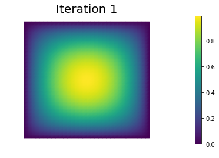


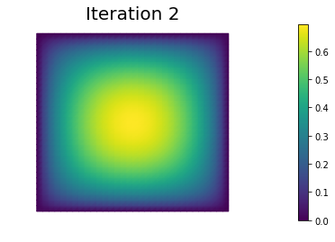


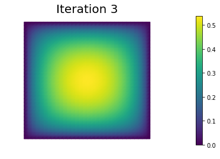


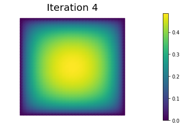


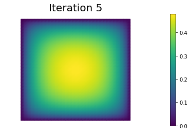


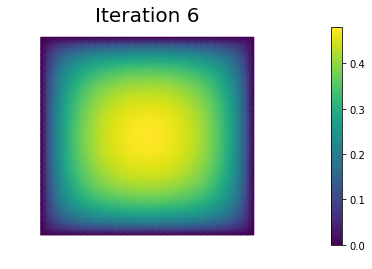


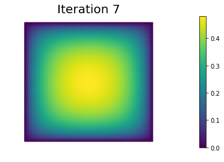


```python
uh.assign(dl.interpolate(dl.Constant(0.), Vh))
parameters={"symmetric": True, "newton_solver": {"relative_tolerance": 1e-9, "report": True, \
                                                 "linear_solver": "cg", "preconditioner": "petsc_amg"}}
dl.solve(grad == 0, uh, bc, J=H, solver_parameters=parameters)
final_g = dl.assemble(grad)
bc.apply(final_g)

print ( "Norm of the gradient at converge", final_g.norm("l2") )
print ("Value of the energy functional at convergence", dl.assemble(Pi) )
nb.plot(uh)
plt.show()
```

    Norm of the gradient at converge 8.041168028721095e-15
    Value of the energy functional at convergence -0.17969096618442762


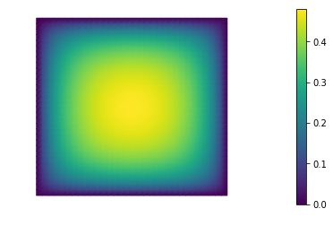


## Hands on

Consider the following nonlinear minimization problem

*Find * $$u^* \in H^1(\Omega)$$ *such that*

$$ u^* = \operatorname*{argmin}_{u \in H^1(\Omega)} \Pi(u), $$

where

$$ \Pi(u) = \frac{1}{2} \int_\Omega |\nabla u|^2 \, dx + \int_\Omega e^{-u} \, dx + \frac{1}{2}\int_{\partial \Omega} u^2 \, ds \quad \forall u \in H^1(\Omega). $$

### Question 1

> Derive the first-order necessary condition for optimality using calculus of variations, in both weak and strong form.

Let $$\delta_u \Pi(u, \hat{u})$$ denote the first variation of $$\Pi(u)$$ in the *direction* $$\hat{u}$$, i.e.

$$\delta_u \Pi(u, \hat{u}) := \left. \frac{d}{d \varepsilon} \Pi(u + \varepsilon \hat{u})\right|_{\varepsilon=0} = \lim_{\varepsilon \rightarrow 0} \frac{\Pi(u + \varepsilon \hat{u}) - \Pi(u)}{\varepsilon}.$$

The necessary condition is that the first variation of $$\Pi(u)$$ equals to 0 for all directions $$\hat{u}$$:

$$ \delta_u \Pi = 0 \Longleftrightarrow \lim_{\varepsilon \rightarrow 0} \frac{\Pi(u + \varepsilon \hat{u}) - \Pi(u)}{\varepsilon} = 0 \quad \forall \hat{u} \in H^1(\Omega).$$

To obtain the weak form of the above necessary condition, we first expand the term $$\Pi(u + \varepsilon \hat{u})$$ as

$$\Pi(u + \varepsilon \hat{u}) = \frac{1}{2} \int_\Omega (\nabla u + \varepsilon \nabla \hat{u})\cdot(\nabla u + \varepsilon \nabla \hat{u}) dx + \int_\Omega e^{-(u+\varepsilon\hat{u})} dx + \frac{1}{2}\int_{\partial \Omega} (u+\varepsilon\hat{u})^2 \, ds .$$

Then, we have

$$ \frac{d}{d \varepsilon} \Pi(u + \varepsilon \hat{u}) = \int_\Omega (\nabla u + \varepsilon \nabla \hat{u})\cdot \nabla \hat{u}\, dx + \int_\Omega e^{-(u+\varepsilon\hat{u})}(-\hat{u})\, dx + \int_{\partial \Omega} (u+\varepsilon\hat{u})\hat{u} \, ds.$$

After setting $$\varepsilon = 0$$, we write the weak form of the necessary conditions as

*Find *$$u\in H^1(\Omega)$$ *such that*

$$ \int_\Omega \nabla u \cdot\nabla \hat{u}\, dx - \int_\Omega e^{-u}\,\hat{u}\, dx + 
\int_{\partial \Omega} u \, \hat{u} \, ds = 0 \quad \forall \hat{u} \in H^1.$$

To obtain the strong form, we invoke Green's first identity and write

$$ - \int_\Omega \Delta u \, \hat{u}\, dx + \int_{\partial\Omega} (\nabla u \cdot \boldsymbol{n})\, \hat{u}\,dx - \int_\Omega e^{-u}\,\hat{u}\, dx + \int_{\partial \Omega} u \, \hat{u} \, ds= 0 \quad \forall \hat{u} \in H^1.$$

Since $$\hat{u}$$ is arbitrary in $$\Omega$$ and on $$\partial \Omega$$, the strong form of the non-linear boundary problem reads

$$ - \Delta u - e^{-u} = 0 \quad {\rm in} \; \Omega; $$
$$ \nabla u \cdot \boldsymbol{n} + u = 0 \quad {\rm on} \; \partial\Omega.$$

> Note: The boundary condition $$\nabla u \cdot \boldsymbol{n} + u = 0$$ is a *Robin* type boundary condition.


### Question 2

> Derive the infinite-dimensional Newton step, in both weak and strong form.

To derive the infinite-dimensional Newton step, we first compute the second variation of $$\Pi$$, that is

$$ \delta^2_{uu} \Pi(u,\hat{u},\tilde{u}) = \left. \frac{d}{d\varepsilon}\left[\delta_u \Pi(u +\varepsilon \tilde{u},\hat{u})\right]\right|_{\varepsilon=0}.$$


After some simplification, we obtain

$$\delta^2 \Pi(u, \tilde{u}, \hat{u}) = \int_\Omega \nabla \tilde{u} \cdot\nabla \hat{u}\, dx + \int_\Omega e^{-u}\,\tilde{u}\,\hat{u}\, dx + \int_{\partial\Omega } \tilde{u}\, \hat{u}\, ds.$$

The weak form of Newton step then reads

*Given *$$u^{(n)} \in H^1$$, *find * $$\tilde{u} \in H^1$$ *such that*

$$ \int_\Omega \nabla \tilde{u} \cdot\nabla \hat{u}\, dx + \int_\Omega e^{-u^{(n)}}\,\tilde{u}\,\hat{u}\, dx + \int_{\partial\Omega } \tilde{u}\, \hat{u}\,ds = -
\left( \int_\Omega \nabla u^{(n)} \cdot\nabla \hat{u}\, dx - \int_\Omega e^{-u^{(n)}}\,\hat{u}\, dx + \int_{\partial\Omega } u^{(n)}\, \hat{u}\right) \quad \forall \hat{u} \in H^1.$$

*Update the solution using the direction* $$\tilde{u}$$

$$ u^{(n+1)} = u^{(n)} + \alpha \tilde{u}.$$

Here $$\alpha$$ denotes a relaxation parameter (back-tracking/line-search) used to achieve global convergence of the Newton method.

Finally the strong form of the Newton step reads

$$ - \Delta \tilde{u} + e^{-u^{(n)}}\tilde{u} = \Delta u^{(n)} + e^{-u^{(n)}} \quad {\rm in} \; \Omega; $$
$$ \nabla \tilde{u} \cdot \boldsymbol{n} + \tilde{u}= -\nabla u^{(n)} \cdot \boldsymbol{n} - u^{(n)} \quad {\rm on} \; \partial\Omega.$$

### Question 3

> Discretize and solve the above nonlinear minimization problem using FEniCS.


```python
nx = 32
ny = 32
mesh = dl.UnitSquareMesh(nx,ny)
Vh = dl.FunctionSpace(mesh, "CG", 1)

uh = dl.Function(Vh)
u_hat = dl.TestFunction(Vh)
u_tilde = dl.TrialFunction(Vh)

print( "dim(Vh) = ", Vh.dim() )

Pi   = dl.Constant(.5)*dl.inner(dl.grad(uh), dl.grad(uh))*dl.dx + dl.exp(-uh)*dl.dx + dl.Constant(.5)*uh*uh*dl.ds
grad = dl.inner(dl.grad(u_hat), dl.grad(uh))*dl.dx - u_hat*dl.exp(-uh)*dl.dx + uh*u_hat*dl.ds
H    = dl.inner(dl.grad(u_hat), dl.grad(u_tilde))*dl.dx + u_hat*u_tilde*dl.exp(-uh)*dl.dx + u_tilde*u_hat*dl.ds

uh.assign(dl.interpolate(dl.Constant(0.), Vh))

rtol = 1e-9
max_iter = 10

pi0 = dl.assemble(Pi)
g0 = dl.assemble(grad)
tol = g0.norm("l2")*rtol

du = dl.Function(Vh).vector()

lin_it = 0
print ("{0:3} {1:3} {2:15} {3:15} {4:15}".format(
      "It", "cg_it", "Energy", "(g,du)", "||g||l2") )

for i in range(max_iter):
    [Hn, gn] = dl.assemble_system(H, grad)
    if gn.norm("l2") < tol:
        print ("\nConverged in ", i, "Newton iterations and ", lin_it, "linear iterations.")
        break
    myit = dl.solve(Hn, du, gn, "cg", "petsc_amg")
    lin_it = lin_it + myit
    uh.vector().axpy(-1., du)
    pi = dl.assemble(Pi)
    print ("{0:3d} {1:3d} {2:15e} {3:15e} {4:15e}".format(
      i, myit, pi, -gn.inner(du), gn.norm("l2")) )
      
plt.figure()
nb.plot(uh, mytitle="Solution", )
plt.show()

```

    dim(Vh) =  1089
    It  cg_it Energy          (g,du)          ||g||l2        
      0   4    8.858149e-01   -2.247173e-01    3.076215e-02
      1   4    8.857473e-01   -1.352648e-04    7.406045e-04
      2   5    8.857473e-01   -3.976430e-11    5.593599e-07
      3   6    8.857473e-01   -1.214857e-21    4.624314e-11
    
    Converged in  4 Newton iterations and  19 linear iterations.


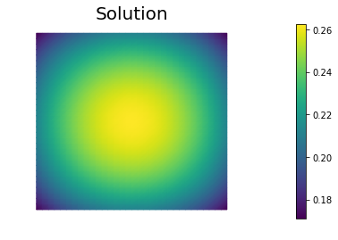

