# Ill-posedness: An illustrative example

## 1D Inverse Heat Equation

An illustrative example of ill-posedness is the inversion for the initial condition for a one-dimensional heat equation.

Specifically, we consider a rod of length $$L$$, and let $$u(x,t)$$ denote the temperature of the rod at point $$x$$ and time $$t$$. 
We are interested in reconstructing the initial temperature profile $$m(x) = u(x, 0)$$ given some noisy measurements $$d$$ of the temperature profile at a later time $$T$$.

### Forward problem

Given
- the initial temperature profile $$u(x,0) = m(x)$$,
- the thermal diffusivity $$k$$,
- a prescribed temperature $$u(0,t) = u(L,t) = 0$$ at the ends of the rod,

solve the heat equation

$$
\left\{
\begin{array}{ll}
\frac{\partial u}{\partial t} - k \frac{\partial^2}{\partial x^2} u = 0 & \forall x\,\in\,(0, L)\; \forall t \in (0,T)\\
u(x, 0) = m(x) & \forall x \in [0,L] \\
u(0,t) = u(L,t) = 0 & \forall t \in (0, T],
\end{array}
\right.
$$

and observe the temperature at the final time $$T$$:

$$ \mathcal{F}(m) = u(x, T). $$

#### Analytical solution to the forward problem
Verify that if

$$ m(x) = \sin\left(i\, \frac{\pi}{L} x \right), \quad i = 1,2,3, \ldots ,$$

then

$$ u(x,t) = e^{ -k\left(i\, \frac{\pi}{L} \right)^2 t} \sin\left(i\,\frac{\pi}{L} x \right) $$

is the unique solution to the heat equation.

### Inverse problem

Given the forward model $$\mathcal{F}$$ and a noisy measurement $$d$$ of the temperature profile at time $$T$$, find the initial temperature profile $$m$$ such that

$$ \mathcal{F}(m) = d. $$

### Ill-posedness of the inverse problem

Consider a perturbation

$$ \delta m(x) = \varepsilon \sin\left(i \, \frac{\pi}{L} x \right), $$

where $$\varepsilon > 0$$ and $$i = 1, 2, 3, \ldots$$.

Then, by linearity of the forward model $$\mathcal{F}$$, the corresponding perturbation $$\delta d(x) = \mathcal{F}(m + \delta m) - \mathcal{F}(m)$$ is

$$ \delta d(x) = \varepsilon\, e^{ -k\left(i \, \frac{\pi}{L}\right)^2 T} \sin\left(i \, \frac{\pi}{L} x \right),$$

which converges to zero as $$i \rightarrow +\infty$$.

Hence the ratio between $$\delta m$$ and $$\delta d$$ can become arbitrary large, which shows that the stability requirement for well-posedness can not be satisfied.

### Discretization

To discretize the problem, we use finite differences in space and Implicit Euler in time.

#### Semidiscretization in space
We divide the $$[0, L]$$ interval in $$n_x$$ subintervals of the same lenght $$h = \frac{L}{n_x}$$, and we denote with $$u_j(t) := u( jh, t)$$ the value of the temperature at point $$x_j = jh$$ and time $$t$$.

We then use a centered finite difference approximation of the second derivative in space and write

$$ \frac{\partial u_j(t)}{\partial t} - k \frac{u_{j-1}(t) - 2u_j(t) + u_{j+1}(t)}{h^2} \quad \text{for } j=1,2,\ldots,n_x-1,$$

with the boundary condition $$u_0(t) = u_{n_x}(t) = 0$$.

We let $$n = n_x-1$$ be the number of discretization points in the interior of the interval $$[0, L]$$, and let 

$$ \mathbf{u}(t) = \begin{bmatrix}u_1(t)\\u_2(t)\\ \ldots\\ u_{n_x-1}(t) \end{bmatrix} \in \mathbb{R}^n $$

be the vector collecting the values of the temperature $$u(x,t)$$ at the points $$x_j = j\,h$$ with $$j=1,\ldots,n_x-1$$.

We then write the system of ordinary differential equations (ODEs):
$$ \frac{\partial}{\partial t} \mathbf{u}(t) + K \mathbf{u}(t) = 0,$$
where $$K \in \mathbb{R}^{n \times n}$$ is the tridiagonal matrix given by

$$ K = \frac{k}{h^2}\begin{bmatrix}  2 & -1 &       &        &        &    \\
                                    -1 &  2 & -1    &        &        &    \\
                                       & -1 &  2    & -1     &        &    \\
                                       &    &\ldots & \ldots & \ldots &    \\
                                       &    &       & -1     &     2  & -1 \\ 
                                       &    &       &        &     -1 & 2  \\
                     \end{bmatrix}.$$
                     
#### Time discretization
We subdivide the time interval $$(0, T]$$ in $$n_t$$ time step of size $$\Delta t = \frac{T}{n_t}$$.
By letting $$\mathbf{u}^{(i)} = \mathbf{u}(i\,\Delta t)$$ denote the discretized temperature profile at time $$t_i = i\,\Delta t$$, the Implicit Euler scheme reads

$$ \frac{\mathbf{u}^{(i+1)} - \mathbf{u}^{(i)}}{\Delta t} + K\mathbf{u}^{(i+1)} = 0, \quad \text{for } i=0,1,\ldots, n_t-1.$$

After simple algebraic manipulations and exploiting the initial condition $$u(x,0) = m(x)$$, we then obtain

$$
\left\{
\begin{array}
\mathbf{u}^{(0)} = \mathbf{m} \\
\mathbf{u}^{(i+1)} = \left( I + \Delta t\, K\right)^{-1} \mathbf{u}^{(i)},
\end{array}
\right.
$$

or equivalently

$$ \mathbf{u}^{(i)} = \left( I + \Delta t\, K\right)^{-i} \mathbf{m}.$$

In the code below, the function `assembleMatrix` generates the finite difference matrix $$\left( I + \Delta t\, K \right)$$ and the function `solveFwd` evaluates the forward model

$$ F\, \mathbf{m} = \left( I + \Delta t\, K\right)^{-n_t}\, \mathbf{m}. $$


```python
from __future__ import print_function, absolute_import, division

import numpy as np
import scipy.sparse as sp
import scipy.sparse.linalg as la
import matplotlib.pyplot as plt
%matplotlib inline

def plot(f, style, **kwargs):
    x = np.linspace(0., L, nx+1)
    f_plot = np.zeros_like(x)
    f_plot[1:-1] = f
    plt.plot(x,f_plot, style, **kwargs)
    
def assembleMatrix(k, h, dt, n):
    diagonals = np.zeros((3, n))   # 3 diagonals
    diagonals[0,:] = -1.0/h**2
    diagonals[1,:] =  2.0/h**2
    diagonals[2,:] = -1.0/h**2
    K = k*sp.spdiags(diagonals, [-1,0,1], n,n)
    M = sp.spdiags(np.ones(n), 0, n,n)
    
    return M + dt*K
    

def solveFwd(m, k, h, dt, n, nt):
    A = assembleMatrix(k, h, dt, n)
    u_old = m.copy()
    for i in np.arange(nt):
        u = la.spsolve(A, u_old)
        u_old[:] = u
        
    return u        
```

### A naive solution to the inverse problem

If $$\mathcal{F}$$ is invertible a naive solution to the inverse problem $$\mathcal{F} m = d$$ is simply to set

$$ m = \mathcal{F}^{-1} d. $$

The function `naiveSolveInv` computes the solution of the discretized inverse problem $$\mathbf{m} = F^{-1} \mathbf{d}$$ as

$$ \mathbf{m} = \left( I + \Delta t\,K\right)^{n_t} \mathbf{d}. $$

The code below shows that:
- for a very coarse mesh (`nx = 20`) and no measurement noise (`noise_std_dev = 0.0`) the naive solution is quite good
- for a finer mesh (`nx = 100`) and/or even small measurement noise (`noise_std_dev = 1e-4`) the naive solution is garbage


```python
def naiveSolveInv(d, k, h, dt, n, nt):
    A = assembleMatrix(k, h, dt, n)
    
    p_i = d.copy()
    for i in np.arange(nt):
        p = A*p_i
        p_i[:] = p
        
    return p

T = 1.0
L = 1.0
k = 0.005
```


```python
print("Very coarse mesh and no measurement noise")
nx = 20
nt = 100

noise_std_dev = 0.

h = L/float(nx)
dt = T/float(nt)

x = np.linspace(0.+h, L-h, nx-1) #place nx-1 equispace point in the interior of [0,L] interval
m_true = 0.5 - np.abs(x-0.5)
u_true = solveFwd(m_true, k, h, dt, nx-1, nt)

d = u_true + noise_std_dev*np.random.randn(u_true.shape[0])

m = naiveSolveInv(d, k, h, dt, nx-1, nt)

plt.figure(figsize=(8,4))
plt.subplot(1,2,1)
plot(m_true, "-r", label = 'm_true')
plot(m, "-b", label = 'm')
plt.legend()
plt.subplot(1,2,2)
plot(u_true, "-b", label = 'u(T)')
plot(d, "og", label = 'd')
plt.legend()
plt.show()
```

    Very coarse mesh and no measurement noise


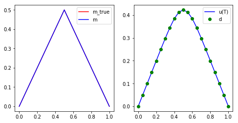


```python
print("Fine mesh and small measurement noise")
nx = 100
nt = 100

noise_std_dev = 1.e-4

h = L/float(nx)
dt = T/float(nt)

x = np.linspace(0.+h, L-h, nx-1) #place nx-1 equispace point in the interior of [0,L] interval
m_true = 0.5 - np.abs(x-0.5)
u_true = solveFwd(m_true, k, h, dt, nx-1, nt)

d = u_true + noise_std_dev*np.random.randn(u_true.shape[0])

m = naiveSolveInv(d, k, h, dt, nx-1, nt)

plt.figure(figsize=(8,4))
plt.subplot(1,2,1)
plot(m_true, "-r", label = 'm_true')
plot(m, "-b", label = 'm')
plt.legend()
plt.subplot(1,2,2)
plot(u_true, "-b", label = 'u(T)')
plot(d, "og", label = 'd')
plt.legend()
plt.show()
```

    Fine mesh and small measurement noise


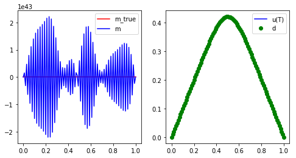


### Why does the naive solution fail?

#### Spectral property of the parameter to observable map

Let $$v_i = \sqrt{\frac{2}{L}} \sin\left( i \, \frac{\pi}{L} x \right)$$ with $$i=1,2,3, \ldots$$, then we have that

$$ \mathcal{F} v_i = \lambda_i v_i, \quad \text{where the eigenvalues } \lambda_i = e^{-kT\left(\frac{\pi}{L} i \right)^2}. $$

**Note**:
- Large eigenvalues $$\lambda_i$$ corresponds to smooth eigenfunctions $$v_i$$;
- Small eigenvalues $$\lambda_i$$ corresponds to oscillatory eigenfuctions $$v_i$$.

The figure below shows that the eigenvalues $$\lambda_i$$ of the continuous parameter to obervable map $$\mathcal{F}$$ decays extremely (exponentially) fast.


```python
import numpy as np
import matplotlib.pyplot as plt
%matplotlib inline

T = 1.0
L = 1.0
k = 0.005

i = np.arange(1,50)
lambdas = np.exp(-k*T*np.power(np.pi/L*i,2))

plt.semilogy(i, lambdas, 'ob')
plt.xlabel('i')
plt.ylabel('lambda_i')
plt.title("Eigenvalues of continuous F")
plt.show()
```


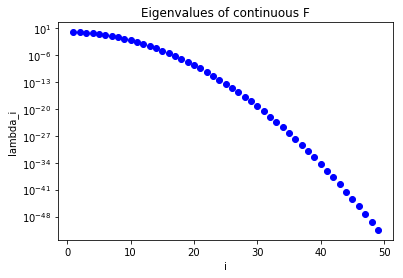


In a similar way, the figure below show the eigenvalues of the discrete parameter to observable map $$F$$: their fast decay means that $$F$$ is extremely ill conditioned.

In the code below we assemble the matrix $$F$$ column-by-column, by computing its actions on the canonical vectors 
$$\mathbf{m}_i = \begin{bmatrix} 0 \\ \ldots \\ 0\\ 1 \\ 0\\ \ldots \\0 \end{bmatrix}, \quad i = 1,\ldots,n,$$
where the $$i$$th entry is the only non-zero component of $$\mathbf{m}_i$$.

> **Disclaimer**: $$F$$ is a large dense implicitly defined operator and should never be built explicitly for a real problem (since it would require $$\mathcal{O}(n)$$ evaluations of the forward problem and $$\mathcal{O}( n^2)$$ storage); instead --- as you will learn later this week --- scalable algorithms for the solution of the inverse problem only require the ability to compute the action of $$F$$ on a few given directions $$\mathbf{m}$$.


```python
def computeEigendecomposition(k, h, dt, n, nt):
    ## Compute F as a dense matrix
    F = np.zeros((n,n))
    m_i = np.zeros(n)
    
    for i in np.arange(n):
        m_i[i] = 1.0
        F[:,i] = solveFwd(m_i, k, h, dt, n, nt)
        m_i[i] = 0.0
    
    ## solve the eigenvalue problem
    lmbda, U = np.linalg.eigh(F)
    ## sort eigenpairs in decreasing order
    lmbda[:] = lmbda[::-1]
    lmbda[lmbda < 0.] = 0.0
    U[:] = U[:,::-1]
    
    return lmbda, U 

## Compute eigenvector and eigenvalues of the discretized forward operator
lmbda, U = computeEigendecomposition(k, h, dt, nx-1, nt)

plt.semilogy(lmbda, 'ob')
plt.title("Eigenvalues of discrete F")
plt.show()
```


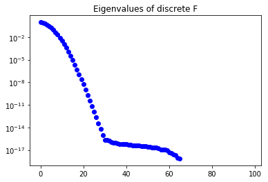


#### Informed and uninformed modes

The functions $$v_i$$ ($$i=1,2,3, \ldots$$) form an orthonormal basis of L^2([0,1]). 

That is, every function $$f \in L^2([0,1])$$ can be written as

$$ f = \sum_{i=1}^\infty \alpha_i v_i, \text{ where } \alpha_i = \int_0^1 f v_i dx.$$

Consider now the noisy problem

$$ d = \mathcal{F}\,m_{\rm true} + \eta, $$

where
- $$d$$ is the data (noisy measurements)
- $$\eta$$ is the noise: $$\eta(x) = \sum_{n=1}^\infty \eta_n v_n(x)$$
- $$m_{\rm true}$$ is the true value of the parameter that generated the data
- $$\mathcal{F}$$ is the forward heat equation

Then, the naive solution to the inverse problem $$\mathcal{F}m = d$$ is

$$ m = \mathcal{F}^{-1}d = \mathcal{F}^{-1}\left( \mathcal{F}\,m_{\rm true} + \eta \right) = m_{\rm true} + \mathcal{F}^{-1} \eta = m_{\rm true} + \mathcal{F}^{-1} \sum_{i=1}^{\infty} \eta_i v_i = m_{\rm true} +  \sum_{i=1}^{\infty} \frac{\eta_i}{\lambda_i} v_i. $$

If the coefficients $$\eta_i = \int_0^1 \eta(x) \, v_i(x) \, dx$$ do not decay sufficiently fast with respect to the eigenvalues $$\lambda_i$$, then the naive solution is unstable.

This implies that oscillatory components can not reliably be reconstructed from noisy data since they correspond to small eigenvalues.

### Tikhonov regularization

The remedy is to find a parameter $$m$$ that solves the inverse problem $$\mathcal{F}\, m = d$$ in a *least squares sense*.
Specifically, we solve the minimization problem

$$ \min_m \frac{1}{2} \int_0^L (\mathcal{F}\, m - d )^2 dx + \frac{\alpha}{2} \mathcal{R}(m), $$

where the Tikhonov regularization $$\mathcal{R}(m)$$ is a quadratic functional of $$m$$.
In what follow, we will penalize the $$L^2$$-norm of the initial condition and let $$\mathcal{R}(m) = \int_0^L m^2 dx$$. However other choices are possible; for example by penalizing the $$L^2$$-norm of the gradient of $$m$$ ($$\mathcal{R}(m) = \int_0^L m_x^2$$), one will favor smoother solutions.

The regularization parameter $$\alpha$$ needs to be chosen appropriately. If $$\alpha$$ is small, the computation of the initial condition $$m$$ is unstable as in the naive approach. On the other hand, if $$\alpha$$ is too large, information is lost in the reconstructed $$m$$. Various criteria --- such as Morozov's discrepancy principle or L-curve criterion  --- can be used to find the optimal amount of regularization (see the **Hands on** section).

#### Morozov's discrepancy principle

The discrepancy principle, due to Morozov, chooses the regularization parameter to be the largest value of $$\alpha$$ such that the norm of the misfit is bounded by the noise level in the data, i.e.,

$$ \| \mathcal{F}\,m_\alpha - d \| \leq \delta, $$ 

where $$\delta$$ is the noise level. Here, $$m_\alpha$$ denotes the parameter found minimizing the Tikhonov regularized minimization problem with parameter $$\alpha$$. This choice aims to avoid overfitting of the data, i.e., fitting the noise.

#### L-curve criterion

Choosing $$\alpha$$ parameter using the L-curve criterion requires the solution of inverse problems for a sequence of regularization parameters. Then, for each $$\alpha$$, the norm of the data misfit (also called residual) $$\| \mathcal{F}\,m_\alpha - d \|$$ is plotted against the norm of the regularization term $$\|m_\alpha\|$$ in a log-log plot.
This curve usually is found to be L-shaped and thus has an *elbow*, i.e. a point of greatest curvature. The L-curve criterion chooses the regularization parameter corresponding to that point. The idea behind the L-curve criterion is that this choice for the regularization parameter is a good compromise between fitting the data and controlling the stability of the parameters. A smaller $$\alpha$$, which correspond to points to the left of the optimal value, only leads to a slightly better data fit while significantly increasing the norm of the parameters. Conversely, a larger $$\alpha$$, corresponding to points to the right of the optimal value, slightly decrease the norm of the solution, but they increase the data misfit significantly.


### Discretization
In the discrete setting, the Tikhonov regularized solution $$\mathbf{m}_{\alpha}$$ solves the penalized least squares problem

$$ \min_{\mathbf{m}} \frac{1}{2} \| F\, \mathbf{m} - \mathbf{d} \|^2 + \frac{\alpha}{2} \| \mathbf{m} \|^2, $$

where $$\| \cdot \|$$ denotes the Euclidean vector norm in $$\mathbb{R}^n$$.

$$\mathbf{m}_{\alpha}$$ can then be computed by solving the normal equations

$$ ( F^t F + \alpha I) \mathbf{m}_{\alpha} = F^t \mathbf{d}.$$

The code below, find the Tikhonov regularized solution $$\mathbf{m}_{\alpha}$$ for $$\alpha = 1e-3$$.

> **Disclaimer**: In the code below, for simplicity, we explicitly construct and factorize the matrix $$F^t F + \alpha I$$. This approach is not feasible and should **never** be used to solve real problems (the computational cost is  $$\mathcal{O}(n^3)$$). Instead, as we will see tomorrow, one should solve the normal equations using the conjugate gradient algorithm, which only requires the ability to compute the action of $$F^t F + \alpha I$$ on a few given directions $$\mathbf{m}$$, and is guaranteed to converge in a number of iterations that is independent of $$n$$.


```python
def assembleF(k, h, dt, n, nt):
    F = np.zeros((n,n))
    m_i = np.zeros(n)
    
    for i in np.arange(n):
        m_i[i] = 1.0
        F[:,i] = solveFwd(m_i, k, h, dt, n, nt)
        m_i[i] = 0.0

    return F

def solveTikhonov(d, F, alpha):    
    H = np.dot( F.transpose(), F) + alpha*np.identity(F.shape[1])
    rhs = np.dot( F.transpose(), d)
    return np.linalg.solve(H, rhs)

## Setup the problem
T = 1.0
L = 1.0
k = 0.005

nx = 100
nt = 100

noise_std_dev = 1e-3

h = L/float(nx)
dt = T/float(nt)

## Compute the data d by solving the forward model
x = np.linspace(0.+h, L-h, nx-1)
#m_true = np.power(.5,-36)*np.power(x,20)*np.power(1. - x, 16)
m_true = 0.5 - np.abs(x-0.5)
u_true = solveFwd(m_true, k, h, dt, nx-1, nt)
d = u_true + noise_std_dev*np.random.randn(u_true.shape[0])

alpha = 1e-3

F = assembleF(k, h, dt, nx-1, nt)
m_alpha = solveTikhonov(d, F, alpha)

plot(m_true, "-r", label = 'm_true')
plot(m_alpha, "-g", label = 'm_tikh')
plt.title("Solution")
plt.legend()
plt.show()
```


## Hands on

## Problem 1: Spectrum of the parameter to observable map

### Question a:
Set $$T=1$$, $$L=1$$, $$n_x = 200$$, and $$n_t = 100$$, and plot the
decay of the eigenvalues of both the continuous ($$\mathcal{F}$$) and
the discrete ($$F$$) parameter-to-observable maps as a function of the index $$i$$.

Do this for the following values of $$k$$: 0.0001, 0.001, 0.01, 0.1, 1.0 (all on the same plot).


```python
T = 1.
L = 1.
nx = 200
nt = 100

# Plot only the first 100 eigenvalues
i = np.arange(1,101)

colors = ['b', 'r', 'g', 'c', 'm']
plt.figure(figsize=(10,5))
for k in [1e-4, 1e-3, 1e-2, 1e-1, 1.]:
    lambdas_continuous  = np.exp(-k*T*np.power(np.pi/L*i,2))
    lambdas_discrete, U = computeEigendecomposition(k, L/float(nx), T/float(nt), nx-1, nt)
    lambdas_discrete    = lambdas_discrete[0:len(i)]
    c = colors.pop()
    plt.semilogy(i, lambdas_continuous, '-'+c, label = "cont_{0:e}".format(k))
    plt.semilogy(i, lambdas_discrete, '-o'+c, label = "discr_{0:e}".format(k))

plt.xlim([0, 150])
plt.ylim([1e-20, 10.])
plt.legend()
plt.show()
    
```


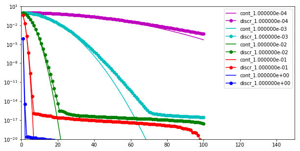


### Question b:
Set $$L=1$$, $$k = 0.01$$ and $$T=0.1$$; plot the decay of the discrete eigenvalues as a function of $$n_x, n_t$$ for different resolutions in the space and time discretization. 

Use $$(n_x, n_t) = (20, 20), (40, 40), (80,80), (160, 160)$$.

What do you observe as you increase the resolution? 


```python
T = 0.1
L = 1.
k = 0.01

colors = ['b', 'r', 'g', 'c', 'm']
plt.figure(figsize=(10,5))
for (nx,nt) in [(20,20), (40,40), (80,80), (160,160)]:
    lambdas_discrete, U = computeEigendecomposition(k, L/float(nx), T/float(nt), nx-1, nt)
    c = colors.pop()
    plt.semilogy(np.arange(1, nx), lambdas_discrete, '-o'+c, label = "{0:d}".format(nx))

plt.xlim([0, 200])
plt.ylim([1e-20, 10.])
plt.legend()
plt.show()
```


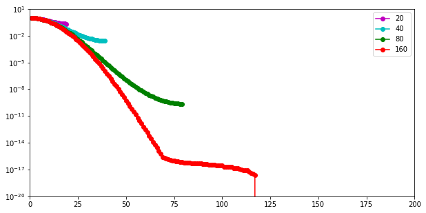


We note that the *dominant* (i.e. largest) eigenvalues are nearly the same at all levels of discretizations. Such eigenvalues are associated with smooth eigenvectors. As we refine the resolution of the discretization we are able to capture smaller eigenvalues, corresponding to highly oscillatory eigenvectors.

These spectral properties are common to many other discretized parameter-to-observable maps.

## Problem 2: Tikhonov Regularization

Consider the same inverse heat equation problem above
with $$L=1$$, $$T=0.1$$, $$k=0.01$$.

Discretize the problem using $$n_x = 200$$ intervals in space and $$n_t = 100$$ time steps.

As initial condition use the (discrete version of) the true initial temperature profile 

$$
m_{\text{true} } = \max(0, 1 - |1 - 4x|) + 100\, x^{10}(1-x)^2.
$$

Use the code below to implement the above function in Python:
```
import numpy as np
x = np.arange(1,n_x, dtype=np.float64)*h
m_true = np.maximum( np.zeros_like(x), 1. - np.abs(1. - 4.*x)) \
         + 100.*np.power(x,10)*np.power(1.-x,2)
```

Add normally distributed noise $$\mathbf{n}$$ with mean zero and
variance $$\sigma^2 = 10^{-4}$$. The resulting noisy observation of the
final time temperature profile is $$\mathbf{d} = F \mathbf{m} + \mathbf{n}$$.


```python
L = 1.
T = 0.1
k = 0.01

nx = 200
nt = 100

noise_std_dev = 1e-2

h = L/float(nx)
dt = T/float(nt)

## Compute the data d by solving the forward model
x = np.linspace(0.+h, L-h, nx-1)
m_true = np.maximum( np.zeros_like(x), 1. - np.abs(1. - 4.*x)) + 100.*np.power(x,10)*np.power(1.-x,2)
u_true = solveFwd(m_true, k, h, dt, nx-1, nt)
d = u_true + noise_std_dev*np.random.randn(u_true.shape[0])

plt.figure(figsize=(8,4))
plt.subplot(1,2,1)
plot(m_true, "-r", label = 'm_true')
plt.legend()
plt.subplot(1,2,2)
plot(u_true, "-b", label = 'u(T)')
plot(d, "og", label = 'd')
plt.legend()
plt.show()
```


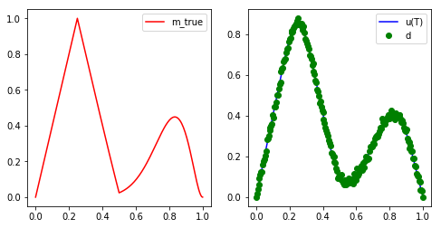


### Question a
Use Tikhonov regularization with $$\alpha = 0.0001,0.001,0.01,0.1,1$$ to compute the regularized
reconstructions $$\mathbf{m}_\alpha$$.


```python
F = assembleF(k, h, dt, nx-1, nt)

colors = ['b', 'r', 'g', 'c', 'm']
for alpha in [1e-4, 1e-3, 1e-2, 1e-1, 1.]:
    m_alpha = solveTikhonov(d, F, alpha)
    plot(m_alpha, "-"+colors.pop(), label = '{0:e}'.format(alpha))

plt.legend()
plt.title("m_alpha")
plt.show()
```


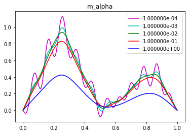


In the *eye norm*, the best reconstruction $$\mathbf{m}_\alpha$$ is for $$\alpha$$ between $$0.01$$ and $$0.001$$. For such values of $$\alpha$$ the reconstructed solution well captures the smooth features of the true parameter, and it does not present spurious oscillations.

### Question b
Determine the (approximate) optimal value of the regularization parameter $$\alpha$$ in the Tikhonov regularization using the L-curve criterion.


```python
norm_m = [] #norm of parameter
norm_r = [] #norm of misfit (residual)
for alpha in [1e-5, 1e-4, 1e-3, 1e-2, 1e-1, 1.]:
    m_alpha = solveTikhonov(d, F, alpha)
    norm_m.append( np.sqrt( np.dot(m_alpha,m_alpha) ) )
    u_alpha = solveFwd(m_alpha, k, h, dt, nx-1, nt)
    norm_r.append( np.sqrt( np.dot(d-u_alpha,d-u_alpha) ) )
    
plt.loglog(norm_r, norm_m, "-ob")
plt.xlabel("|| F m - d ||")
plt.ylabel("|| m ||")
plt.title("L-curve")
plt.show()
```


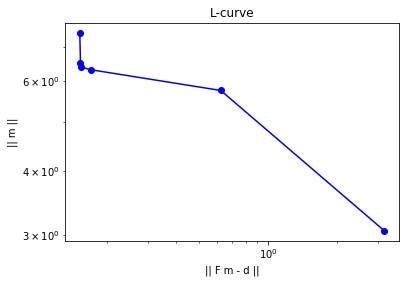


The *elbow* of the L-curve is located between $$\alpha = 10^{-4}$$ and $$\alpha = 10^{-3}$$. 

### Question c
Determine the (approximate) optimal value of the regularization parameter $$\alpha$$ in the Tikhonov regularization 
using Morozov's discrepancy criterion, i.e., find the largest value of $$\alpha$$ such that 

$$
\|F\,\mathbf{m}_\alpha - \mathbf{d}\| \le \delta
$$

where $$\delta=\| \mathbf{n}\|$$ and $$\mathbf{m}_\alpha$$ is the solution of the Tikhonov-regularized inverse problem with regularization parameter $$\alpha$$.


```python
alphas = [1e-5, 1e-4, 1e-3, 1e-2, 1e-1, 1.]
norm_r = [] #norm of misfit (residual)
for alpha in [1e-5, 1e-4, 1e-3, 1e-2, 1e-1, 1.]:
    m_alpha = solveTikhonov(d, F, alpha)
    u_alpha = solveFwd(m_alpha, k, h, dt, nx-1, nt)
    norm_r.append( np.sqrt( np.dot(d-u_alpha,d-u_alpha) ) )
    
plt.loglog(alphas, norm_r, "-ob", label="||F m - d ||")
plt.loglog(alphas, [noise_std_dev*np.sqrt(nx-1)]*len(alphas), "-r", label="||n||")
plt.xlabel("alpha")
plt.legend()
plt.title("Morozov's discrepancy principle")
plt.show()
```


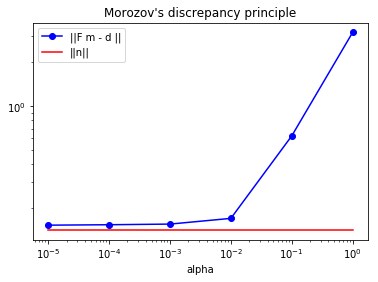


Since the noise $$\mathbf{n}$$ is a i.i.d. Gaussian vector in $$\mathbb{R}^n$$ with marginal variance $$\sigma^2=10^{-4}$$, then we expect the $$\delta = \|\mathbf{n}\|$$ to be of the order of $$\sqrt{ n \sigma^2}$$.

The figure above compares the norm of the misfit $$\|F \mathbf{m}_\alpha - \mathbf{d} \|$$ (blue line) with $$\delta$$ (read line). The Morozov's discrepancy principal then suggests that the optimal $$\alpha$$ is near $$10^{-2}$$ (i.e. where the two lines intersect).

### Question d
Plot the  $$L_2$$ norm error in the reconstruction, $$\|\mathbf{m}_{\text{true}}-\mathbf{m}_\alpha\|$$, as a function of $$\alpha$$, where $$\mathbf{m}_\alpha$$ is the Tikhonov regularized solution. Which value of $$\alpha$$ (approximately) minimizes this error? Compare the *optimal* values of $$\alpha$$ obtained using the L-curve and Morozov's discrepancy criterion.


```python
alphas = [1e-5, 1e-4, 1e-3, 1e-2, 1e-1, 1.]
err_m = [] #norm of misfit (residual)
for alpha in alphas:
    m_alpha = solveTikhonov(d, F, alpha)
    err_m.append( np.sqrt( np.dot(m_true-m_alpha,m_true-m_alpha) ) )
    
plt.loglog(alphas, err_m, "-ob", label="||m_true - m_alpha ||")
plt.xlabel("alpha")
plt.legend()
plt.title("Reconstruction error")
plt.show()
```


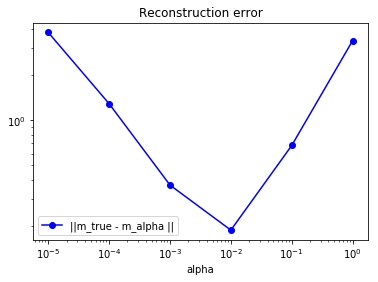


The $$\alpha$$ obtained using the Morozov's discrepancy principle is very close to the value of $$\alpha$$ that minimizes the reconstruction error in the $$L^2(\Omega)$$ norm. The $$\alpha$$ obtained using the L-curve criterion is smaller than the value of $$\alpha$$ that minimizes the reconstruction error in the $$L^2(\Omega)$$ norm, thus indicating that the L-curve criterion underestimates the amount of regularization necessary for solving this inverse problem.

## Problem 3: Tikhonov regularization on the gradient of $$m$$

Consider the Tikhonov regularized solution $$m_\alpha$$ where we penalize the norm of the *gradient* of $$m$$.
That is, $$m_\alpha$$ solves minimization problem

$$ \min_m \frac{1}{2} \int_0^L (\mathcal{F}\, m - d )^2 dx + \frac{\alpha}{2} \int_0^L m_x^2 \, dx. $$

### Question a

Discretize and solve the inverse problem using the same parameters and true initial condition as in Problem 2.


```python
L = 1.
T = 0.1
k = 0.01

nx = 200
nt = 100

noise_std_dev = 1e-2

h = L/float(nx)
dt = T/float(nt)

## Compute the data d by solving the forward model
x = np.linspace(0.+h, L-h, nx-1)
m_true = np.maximum( np.zeros_like(x), 1. - np.abs(1. - 4.*x)) + 100.*np.power(x,10)*np.power(1.-x,2)
u_true = solveFwd(m_true, k, h, dt, nx-1, nt)
d = u_true + noise_std_dev*np.random.randn(u_true.shape[0])

# Assemble the regularization matrix corresponding to the laplacian of m
R = -np.diag(np.ones(d.shape[0]-1), -1) + 2*np.diag(np.ones(d.shape[0]),0) - np.diag(np.ones(d.shape[0]-1), 1)
R*= h**(-2)

F = assembleF(k, h, dt, nx-1, nt)

def solveTikhonov2(d, F, R, alpha): 
    H = np.dot( F.transpose(), F) + alpha*R
    rhs = np.dot( F.transpose(), d)
    return np.linalg.solve(H, rhs)

colors = ['b', 'r', 'g', 'c', 'm']
for alpha in [1e-6, 1e-5, 1e-4, 1e-3, 1e-2]:
    m_alpha = solveTikhonov2(d, F, R, alpha)
    plot(m_alpha, "-"+colors.pop(), label = '{0:e}'.format(alpha))

plt.legend()
plt.title("m_alpha")
plt.show()
```


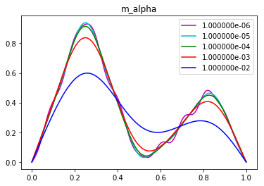


### Question b

Determine the *optimal* amount of regularization using either the L-curve criterion or the discrepancy principle.
How does this solution differs from the one computed in Problem 2?


```python
alphas = [1e-7, 1e-6, 1e-5, 1e-4, 1e-3, 1e-2]
norm_r = [] #norm of misfit (residual)
for alpha in alphas:
    m_alpha = solveTikhonov2(d, F, R, alpha)
    u_alpha = solveFwd(m_alpha, k, h, dt, nx-1, nt)
    norm_r.append( np.sqrt( np.dot(d-u_alpha,d-u_alpha) ) )
    
plt.loglog(alphas, norm_r, "-ob", label="||F m - d ||")
plt.loglog(alphas, [noise_std_dev*np.sqrt(nx-1)]*len(alphas), "-r", label="||n||")
plt.xlabel("alpha")
plt.legend()
plt.title("Morozov's discrepancy principle")
plt.show()
```


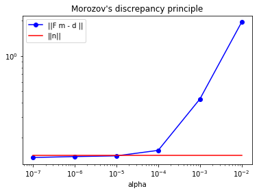


According to the Morozov's discrepancy principle, $$\alpha$$ should be chosen between $$10^{-5}$$ and $$10^{-4}$$.


```python
norm_m = [] #norm of parameter
norm_r = [] #norm of misfit (residual)
for alpha in [1e-9, 1e-8, 1e-7, 1e-6, 1e-5, 1e-4, 1e-3, 1e-2]:
    m_alpha = solveTikhonov2(d, F, R, alpha)
    norm_m.append( np.sqrt( np.dot(m_alpha,m_alpha) ) )
    u_alpha = solveFwd(m_alpha, k, h, dt, nx-1, nt)
    norm_r.append( np.sqrt( np.dot(d-u_alpha,d-u_alpha) ) )
    
plt.loglog(norm_r, norm_m, "-ob")
plt.xlabel("|| F m - d ||")
plt.ylabel("|| m ||")
plt.title("L-curve")
plt.show()
```


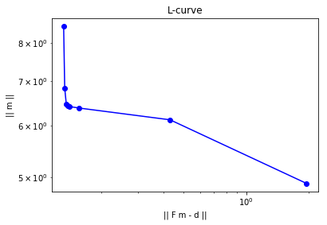


According to the Morozov's discrepancy principle, $$\alpha$$ should be chosen between $$10^{-7}$$ and $$10^{-5}$$.

Copyright &copy; 2018, The University of Texas at Austin & University of California, Merced. All Rights reserved. See file COPYRIGHT for details.

This file is part of the hIPPYlib library. For more information and source code availability see https://hippylib.github.io.

hIPPYlib is free software; you can redistribute it and/or modify it under the terms of the GNU General Public License (as published by the Free Software Foundation) version 2.0 dated June 1991.
